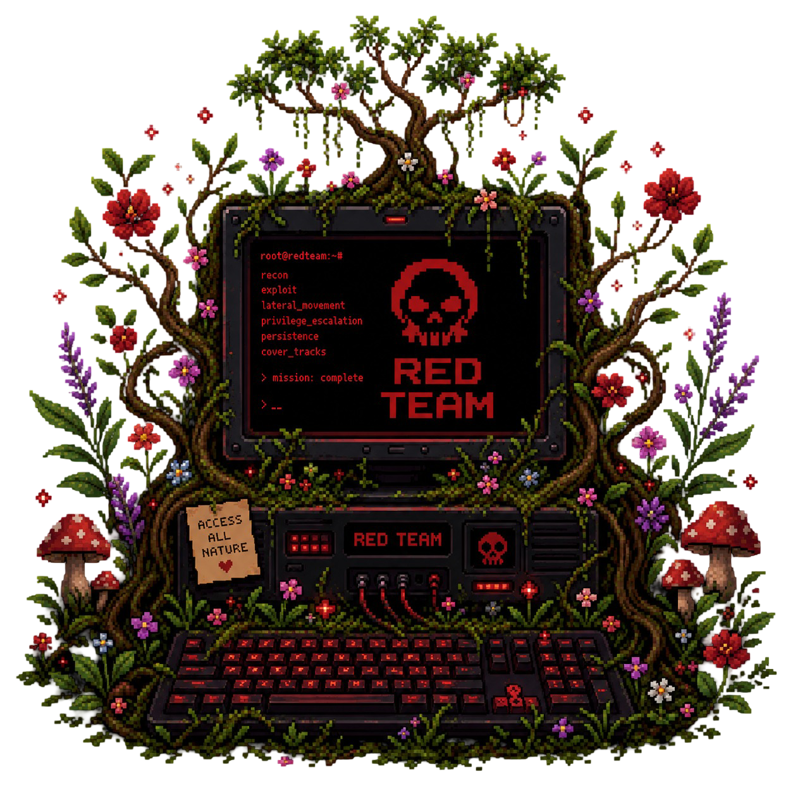
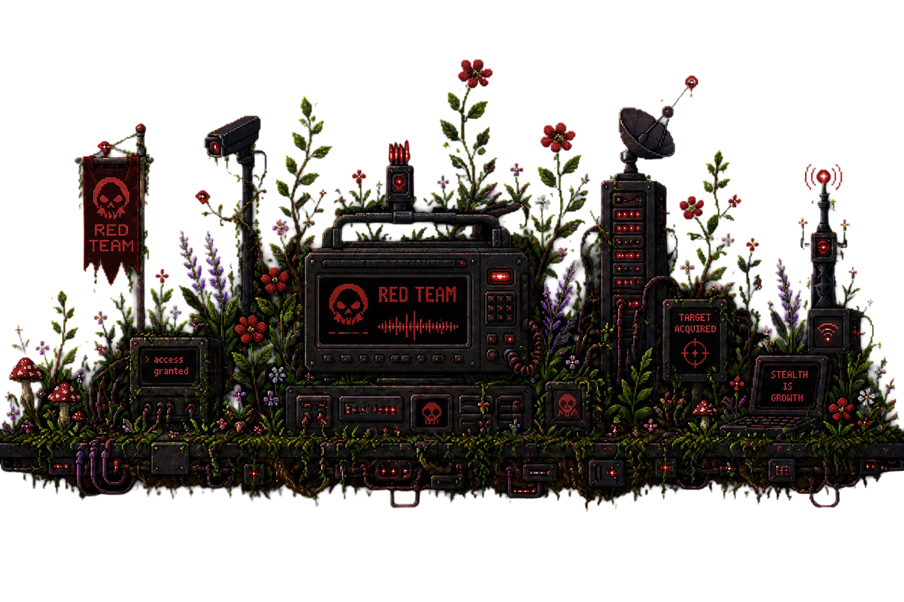

  <!-- Imagem do Topo (Monitor Red Team) -->
  

    

  # 🌿 C Y B E R . G A R D E N
  
  
  
  

    
  <i>"A superfície de ataque que você não mapeia é a raiz que compromete o sistema."</i>

 

## 👁️‍🗨️ O Bioma (A Mente por trás do Jardim)

Bem-vindo ao meu **Digital Garden**. Este repositório é a união orgânica entre a paciência necessária para cultivar conhecimento e a agressividade analítica do *Red Team*.

O jargão técnico entra como uma semente bruta, é dissecado, e floresce como uma análise tática orientada a negócios e Governança (GRC).

 

## 🪴 Os Canteiros (Índice de Conhecimento)

<table>
  <tr>
    <td align="center" width="20%">
      <h1 style="margin: 0;">🌱</h1>
      <b><a href="/raizes">/raizes</a></b>
    </td>
    <td width="80%">
      <b>A Base (Redes & Arquitetura)</b> 
      Onde tudo se sustenta. Protocolos, <i>TCP Handshake</i>, portas e o mapeamento do terreno (Reconhecimento).
    </td>
  </tr>
  <tr>
    <td align="center" width="20%">
      <h1 style="margin: 0;">🥀</h1>
      <b><a href="/espinhos">/espinhos</a></b>
    </td>
    <td width="80%">
      <b>O Ataque (Vulnerabilidades)</b> 
      A beleza letal do ataque. Dissecação de falhas e como invasores exploram arquiteturas mal podadas.
    </td>
  </tr>
  <tr>
    <td align="center" width="20%">
      <h1 style="margin: 0;">🌳</h1>
      <b><a href="/copa">/copa</a></b>
    </td>
    <td width="80%">
      <b>A Visão Global (GRC & IA Ética)</b> 
      Governança, compliance e as políticas que protegem o ecossistema corporativo.
    </td>
  </tr>
</table>

 

## 🧭 Metodologia de Cultivo

Cada estudo documentado aqui obedece a um ritual rígido de dissecação:
1. 🌰 **A Semente:** O conceito técnico puro.
2. 🗣️ **O Solo:** A tradução e analogias.
3. 📉 **A Praga:** O risco de negócios e GRC.
4. ⚔️ **A Ofensiva:** O olhar do <i>Red Team</i>.
5. 🛡️ **A Poda:** A mitigação defensiva.

  

  <!-- Imagem da Base (Paisagem Red Team) -->
  
  
    
  
Semeado, cultivado e documentado por <a href="https://github.com/suares13">@suares13</a>

